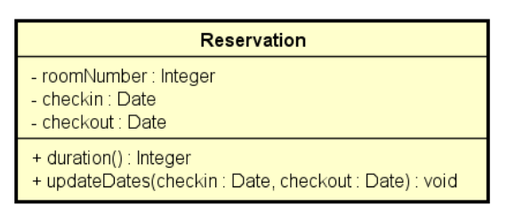
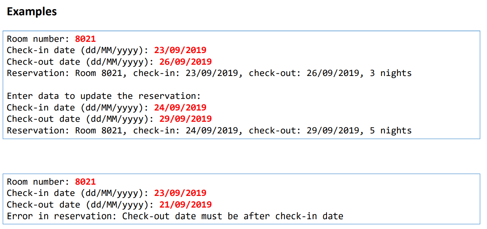

# Reserva Hotel

 Ler os dados de uma reserva de hotel (número do quarto, data
de entrada e data de saída) e mostrar os dados da reserva, inclusive sua duração em
dias. Em seguida, ler novas datas de entrada e saída, atualizar a reserva, e mostrar
novamente a reserva com os dados atualizados. O programa não deve aceitar dados
inválidos para a reserva, conforme as seguintes regras:

### Regras de Negócio:
#### - Alterações de reserva só podem ocorrer para datas futuras
#### - A data de saída deve ser maior que a data de entrada

### Diagrama da classe reserva:

### Como deve ser a saída da reserva:
